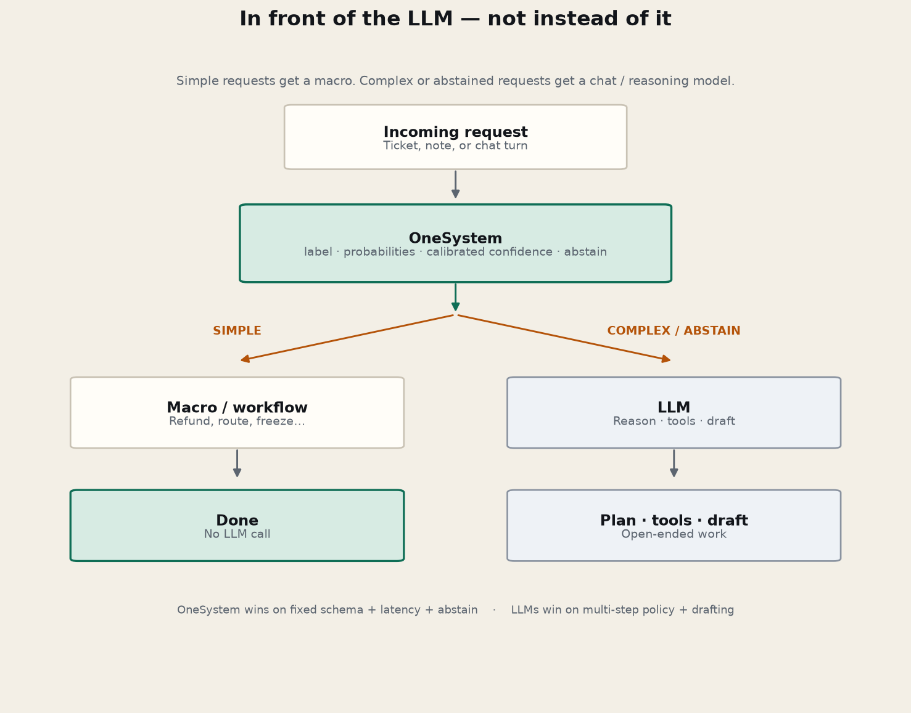
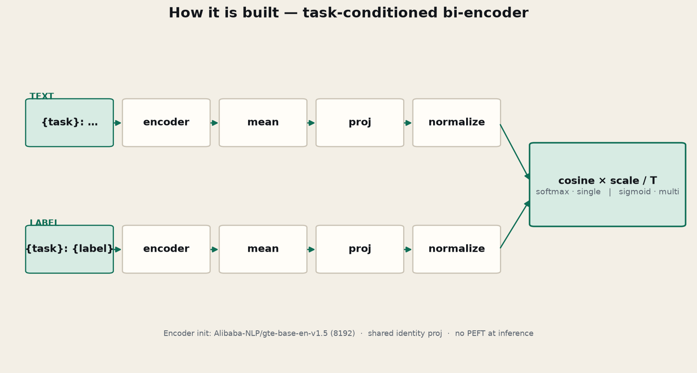

# OneSystem

**A production-ready System‑1 decision engine for LLM pipelines.**

Pass a short document and the labels that are legal for a decision. OneSystem returns a typed answer, a probability table, and calibrated confidence in **one forward pass**. It does **not** generate text. It sits **in front of** chat / reasoning models so simple requests never pay for an LLM call.

**Repo:** [github.com/kiranbeethoju/onesystem](https://github.com/kiranbeethoju/onesystem) · **Release:** [v0.3.0](https://github.com/kiranbeethoju/onesystem/releases/tag/v0.3.0) · **Cookbook:** [kiranbeethoju.github.io/onesystem](https://kiranbeethoju.github.io/onesystem/) · **Benchmarks:** [BANKING77 · CLINC150 · HWU64 · GoEmotions](https://kiranbeethoju.github.io/onesystem/benchmarks.html)

---

## 1. What is OneSystem?

OneSystem is a **standalone classifier** (own weights, ~550 MB). Not a chat model. Not a LoRA on someone else’s decision checkpoint.

| You need | OneSystem |
|---|---|
| One label from a fixed set | Native (softmax) |
| Several tags at once | Native (sigmoid + threshold) |
| Urgency / severity scale | Ordinal `score` |
| Calibrated confidence | Temperature fit after training |
| “Don’t guess — escalate” | `min_confidence` → `abstain` |
| Draft an email / plan / tool calls | **No** — hand off to an LLM |

Architecturally closer to embedding classifiers (BGE / E5 / GTE) than to an LLM.

---

## 2. Why not use an LLM for every request?

Many tickets only need: document type? urgency? department? handoff?

That is **routing**, not reasoning. An LLM is slower, costlier, and less deterministic for fixed schemas.

| | OneSystem (System‑1) | Chat / reasoning LLM (System‑2) |
|---|---|---|
| Purpose | Typed decision engine | Reasoning, planning, generation |
| Generates text | No | Yes |
| Fixed schema + probabilities | Native | Prompted |
| Calibration & abstain | Designed in | Usually prompted |
| Latency / cost | Very low locally | Higher |
| Best for | Route, filter, prioritize | Synthesis, tools, drafts |

**Bottom line:** put OneSystem **in front of** your LLM — don’t replace the LLM with it.

---

## 3. How it fits in a pipeline



**Simple** — *“I need a refund for the duplicate March charge.”* → refund macro, no LLM.  
**Complex / abstain** — multi-step policy, low confidence, or model error → your chat API.

Regenerate diagrams: `python scripts/render_diagrams.py` (matplotlib).

---

## 4. Load a model (general or domain)

```bash
git clone https://github.com/kiranbeethoju/onesystem.git
cd onesystem && pip install -e .
```

| Domain | Load | After training |
|---|---|---|
| **General v0.3.0** | `OneSystem.load()` | release download |
| **BANKING77** | `OneSystem.load("models/onesystem-banking77")` | `python benchmarks/run_banking77.py` |
| **CLINC150** | `OneSystem.load("models/onesystem-clinc150")` | `python benchmarks/run_clinc150.py` |
| **HWU64** | `OneSystem.load("models/onesystem-hwu64")` | `python benchmarks/run_hwu64.py` |
| **GoEmotions** | `OneSystem.load("models/onesystem-goemotions")` | `python benchmarks/run_goemotions.py` |
| **Your taxonomy** | `OneSystem.load("models/onesystem-mydomain")` | `python -m onesystem.domain_adapt …` |

```python
from onesystem.model import OneSystem

# General release (multi-domain schemas)
model = OneSystem.load()

# Or a domain checkpoint (example: banking)
banking = OneSystem.load("models/onesystem-banking77")
d = banking.classify(
    "I want to transfer money to savings",
    {"intent": ["transfer", "balance", "other"]},  # use the full frozen set in prod
    min_confidence=0.65,
)
```

Cookbook with full configs: [Models](https://kiranbeethoju.github.io/onesystem/#models) · [Domain adapt](https://kiranbeethoju.github.io/onesystem/#domain-adapt)

---

## 5. When OneSystem fails — hit your LLM API

Abstain, exception, or a complex label should call a **custom OpenAI-compatible** endpoint (OpenAI, Azure, vLLM, Groq, …).

```python
import json, os, urllib.request
from onesystem.model import OneSystem

model = OneSystem.load()  # or a domain path
LLM_URL = os.environ.get("LLM_API_URL", "https://api.openai.com/v1/chat/completions")
LLM_KEY = os.environ["LLM_API_KEY"]

def call_llm(text: str, reason: str) -> str:
    body = {
        "model": os.environ.get("LLM_MODEL", "gpt-4o-mini"),
        "messages": [
            {"role": "system", "content": f"OneSystem could not resolve this ({reason}). Help the user."},
            {"role": "user", "content": text},
        ],
    }
    req = urllib.request.Request(
        LLM_URL,
        data=json.dumps(body).encode(),
        headers={"Authorization": f"Bearer {LLM_KEY}", "Content-Type": "application/json"},
        method="POST",
    )
    with urllib.request.urlopen(req, timeout=60) as resp:
        return json.loads(resp.read().decode())["choices"][0]["message"]["content"]

def handle(text, labels):
    try:
        intent = model.classify(text, {"intent": labels}, min_confidence=0.65)["intent"]
    except Exception as exc:
        return {"route": "llm", "reply": call_llm(text, f"error:{exc}")}
    if intent.get("abstain") or intent.get("label") in {None, "other", "complex"}:
        return {"route": "llm", "reply": call_llm(text, "abstain_or_complex"), "decision": intent}
    return {"route": "macro", "action": f"macro:{intent['label']}", "decision": intent}
```

Full pattern: [LLM fallback](https://kiranbeethoju.github.io/onesystem/#llm-fallback)

Colab: [`examples/colab_usecases.py`](examples/colab_usecases.py)

---

## 6. Performance, context, calibration

| Metric | v0.3.0 |
|---|---|
| Encoder init | [`Alibaba-NLP/gte-base-en-v1.5`](https://huggingface.co/Alibaba-NLP/gte-base-en-v1.5) (Apache 2.0, **8192** ctx) |
| Text context | **8192 tokens** (~6k–7k English words), incl. task prefix |
| Label context | **128 tokens** |
| Local holdout (fast-decisions) | Zero-shot **0.457** → fine-tuned **0.590** · ECE **0.057** · T **2.5** |
| BANKING77 test (77-way) | Current **63.3%** → domain-adapted **94.0%** |
| CLINC150 in-scope (150-way) | Current **73.0%** → domain-adapted **97.6%**; OOS recall **91.7%** (threshold from val) |
| HWU64 test (64-way) | Current **64.5%** → domain-adapted **93.7%** |
| GoEmotions (27-way multi-label) | Macro-F1 **8.3%** → **61.0%** · micro-F1 **64.8%** |
| Weights | ~550 MB `model.safetensors` + `encoder/` architecture code |

Scores are dataset-specific — see [benchmarks](https://kiranbeethoju.github.io/onesystem/benchmarks.html). Prefer **2–16** labels per task in production schemas.

### Train a domain checkpoint

```bash
python -m onesystem.domain_adapt \
  --train data/my_domain/train.jsonl \
  --output models/onesystem-mydomain \
  --name OneSystem-MyDomain \
  --epochs 4
```

---

## 7. How it is trained



- Data: public [`fastino/fast-decisions`](https://huggingface.co/datasets/fastino/fast-decisions) development split — 70% train / 10% calib / 20% eval per domain.
- Recipe: AdamW; **max_text_len=8192**, **max_label_len=128**; temperature on calib only.
- Pure PyTorch + Transformers (`transformers>=4.49,<5`) — `python -m onesystem.train` / `onesystem.evaluate`.

---

## 8. Domain recipes

Schemas are yours at inference. Full examples + JSON: [kiranbeethoju.github.io/onesystem](https://kiranbeethoju.github.io/onesystem/).

**E-commerce** · **Financial** · **EdTech** · **Clinical (demo only, not a device)** · **Ops / incident urgency**

```python
model.classify(
    "The deploy failed twice and customers are seeing 500s. Can someone look now?",
    {
        "urgent": {
            "labels": {
                "yes": "Does this need attention right now?",
                "no": "This can wait",
            }
        }
    },
)
```

CLI: `onesystem "Stop the bot and get me a person." --task handoff --labels yes,no`

---

## Layout, contribute, license

| Path | Role |
|---|---|
| `onesystem/model.py` | `classify` / abstain / label cache |
| `onesystem/modeling.py` | Network + save/load |
| `onesystem/hub.py` | Local dir or GitHub release download |
| `onesystem/train.py` / `evaluate.py` | Train, calibrate, ECE |
| `onesystem/domain_adapt.py` | Fine-tune a domain-specific checkpoint |
| `benchmarks/` | BANKING77 / CLINC150 / HWU64 / GoEmotions |
| `scripts/render_diagrams.py` | Pipeline + architecture PNGs |
| `assets/` · `docs/assets/` | Diagram images for README / Pages |
| `examples/colab_usecases.py` | Colab multi-use-case script |
| `docs/` | GitHub Pages cookbook |
| `models/onesystem` | Config, tokenizer, manifest (weights on the release) |

See [CONTRIBUTING.md](CONTRIBUTING.md). Apache 2.0 — [LICENSE](LICENSE), [NOTICE](NOTICE).
